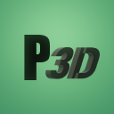
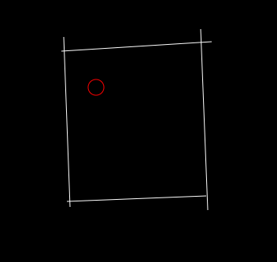
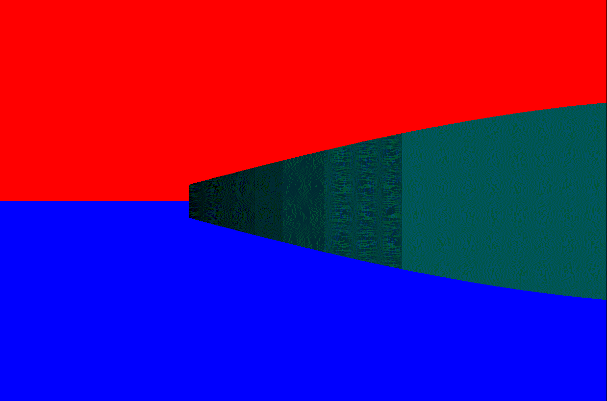
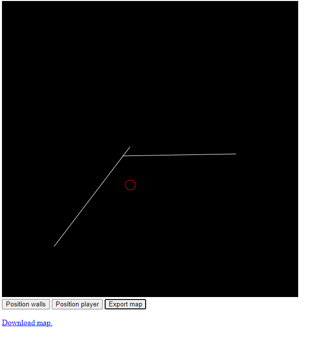

# Pseudo-3D Renderer


P3D is a **P**seudo-**3**D **R**enderer, i.e. [Raycaster](https://lodev.org/cgtutor/raycasting.html)(P3D is not based on the renderer described here, but it's quite informative), much like the one used in games such as Wolfenstein 3D. The project is comprised of two applications: The Renderer itself(`pdr.exe`) and the Map maker(in `util`).

## The Renderer
The renderer operates in the following way:
- Expects a text file, describing a map, to be passed as a command line argument(such a file can be created with the Map maker).
- Reads said file and loads the map into memory.
- From the player's position, a given number of rays are cast forward.
- For each ray, we check whether the ray intersects a wall:
    - *If it does, we draw a vertical stripe(rectangle) on the screen, whose size(and colour) depends on the distance between the player and the intersection point.*
    - *If it doesn't, we simply don't do anything.*

<br>*So basically, we go from this(view from the Map maker):*<br>
```
Red circle - Player
White line - Wall
```



*To this(The rendered wall from the corner of the map)*:



As can be seen, not the entire map is rendered, due to the rays not being long enough to properly intersect the rest of the map.

## Map maker
The Map maker is a simplistic JavaScript-written browser application. You can do the following in it:
- Place walls
- Position the player
- Export the map and download it



When placing walls, *two clicks are required*, one on the position of the starting point and one on the end point of the line you want to place. Placing the player requires only one click, as P3D only needs the starting position of the player. To download the map, you must first press the `Export map` button and only afterwards click the `Download map` hyperlink.